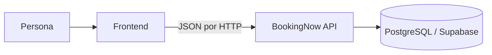
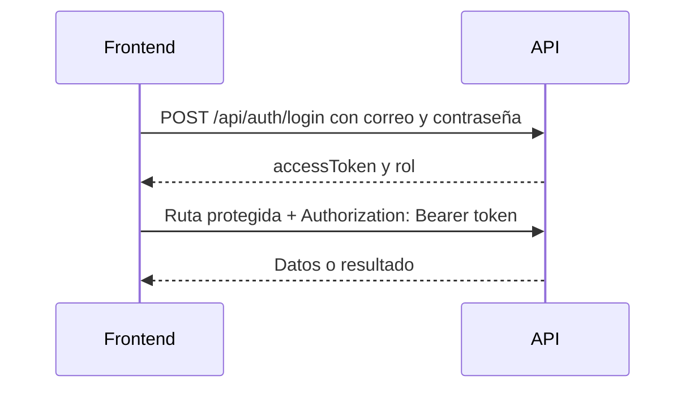

# BookingNow API

Esta API es la parte que guarda los datos y aplica las reglas del proyecto.
El frontend es lo que la persona ve; la API recibe las solicitudes del frontend.



No necesitas saber Java para usarla. Solo debes conocer la ruta, los datos que
envías y cómo usar el token recibido en el login.

## 1. Empieza por Swagger

Con la API encendida, abre `http://localhost:8080/swagger-ui.html`.

Swagger sirve para probar la API sin construir todavía el frontend: eliges una
ruta, escribes datos de ejemplo y pulsas **Execute**.

La dirección base local es:

```text
http://localhost:8080
```

Cuando se publique en Render, se cambia únicamente esa dirección por la URL de
Render. Las rutas, como `/api/auth/login`, seguirán siendo iguales.

Si el frontend corre en `http://localhost:5173` (Vite), `:3000` (React) o `:4200`
(Angular), la API ya permite esas direcciones. Para el dominio publicado del
frontend, configurar `CORS_ALLOWED_ORIGINS` con su URL HTTPS antes de desplegar.

## 2. Cuentas de desarrollo

Después de ejecutar [initial-admin.sql](docs/db/initial-admin.sql) en Supabase,
estas cuentas permiten probar las pantallas. Son datos ficticios de desarrollo.

| Tipo | Correo | Contraseña | Uso |
|---|---|---|---|
| Administrador | `admin@bookingnow.local` | `AdminDemo123!` | Consultar cuentas, negocios y servicios |
| Cliente | `cliente.demo@bookingnow.local` | `ClienteDemo123!` | Probar cuenta de cliente |
| Proveedor | `proveedor.demo@bookingnow.local` | `ProveedorDemo123!` | Probar negocio y servicios |

El proveedor demo ya tiene un negocio, dos elementos multimedia y un servicio.
Estas contraseñas no son secretas y no deben usarse en producción.

## 3. Registro, login y token

Una persona se registra una vez. Luego inicia sesión con correo y contraseña.
La API devuelve un **token**, una cadena larga que prueba quién inició sesión.
Guárdalo durante la sesión y envíalo en las rutas protegidas.



El token dura 30 minutos. Si la API devuelve `401`, elimina el token y pide
iniciar sesión otra vez.

### Código JavaScript mínimo

```js
const API = 'http://localhost:8080';

async function iniciarSesion(correo, contrasena) {
  const respuesta = await fetch(`${API}/api/auth/login`, {
    method: 'POST',
    headers: { 'Content-Type': 'application/json' },
    body: JSON.stringify({ correo, contrasena })
  });

  const datos = await respuesta.json();
  if (!respuesta.ok) throw new Error(datos.detail);

  sessionStorage.setItem('token', datos.accessToken);
  sessionStorage.setItem('rol', datos.cuenta.rol);
  return datos.cuenta;
}

function encabezadosConToken() {
  return {
    'Content-Type': 'application/json',
    Authorization: `Bearer ${sessionStorage.getItem('token')}`
  };
}
```

Para cerrar sesión, borra `token` y `rol` de `sessionStorage`. El campo visual
de contraseña debe usar `type="password"`.

## 4. Qué puede hacer cada rol

| Rol del login | Pantallas o acciones permitidas |
|---|---|
| `CLIENTE` | Ver su propia cuenta. Las reservas llegarán en otro sprint. |
| `PROVEEDOR` | Ver su cuenta, crear un único negocio y gestionar sus servicios. |
| `ADMINISTRADOR` | Consultar clientes, proveedores, negocios y los servicios de cada negocio. |

Usa `cuenta.rol` para mostrar las opciones correctas. La API también revisa los
permisos: ocultar un botón no es una medida de seguridad por sí sola.

## 5. Todas las rutas

Para una ruta protegida agrega este encabezado:

```text
Authorization: Bearer EL_TOKEN_DEL_LOGIN
```

| Método | Ruta | Token | Uso |
|---|---|---:|---|
| GET | `/health` | No | Revisar si la API está viva |
| POST | `/api/clientes` | No | Registrar cliente |
| POST | `/api/proveedores` | No | Registrar proveedor |
| POST | `/api/auth/login` | No | Iniciar sesión de cualquier cuenta |
| GET | `/api/clientes/{id}` | Cliente dueño | Ver su cuenta |
| GET | `/api/proveedores/{id}` | Proveedor dueño | Ver su cuenta |
| DELETE | `/api/clientes/{id}` | Cliente dueño | Eliminar su cuenta |
| DELETE | `/api/proveedores/{id}` | Proveedor dueño | Eliminar su cuenta |
| GET | `/api/clientes` | Administrador | Listar clientes |
| GET | `/api/proveedores` | Administrador | Listar proveedores |
| GET | `/api/negocios` | Administrador | Listar todos los negocios |
| GET | `/api/negocios/mio` | Proveedor | Ver el negocio propio y si puede crear uno |
| POST | `/api/negocios` | Proveedor | Crear negocio |
| GET | `/api/negocios/{idNegocio}/servicios` | Proveedor dueño o administrador | Listar servicios |
| POST | `/api/negocios/{idNegocio}/servicios` | Proveedor dueño | Crear servicio |

## 6. Datos de cada formulario

Envía siempre JSON con el encabezado `Content-Type: application/json`.

### Registrar cliente

`POST /api/clientes`

```json
{
  "correo": "ana@example.com",
  "nombreUsuario": "ana",
  "contrasena": "ClaveDemo123!"
}
```

### Registrar proveedor

`POST /api/proveedores`

```json
{
  "correo": "proveedor@example.com",
  "nombreUsuario": "proveedor_demo",
  "contrasena": "ClaveDemo123!",
  "razonSocial": "Proveedor Demo SAS",
  "nit": "900765432-1"
}
```

### Iniciar sesión

`POST /api/auth/login`

```json
{
  "correo": "proveedor.demo@bookingnow.local",
  "contrasena": "ProveedorDemo123!"
}
```

Respuesta resumida:

```json
{
  "accessToken": "eyJ...",
  "tokenType": "Bearer",
  "expiresIn": 1800,
  "cuenta": {
    "id": 1,
    "rol": "PROVEEDOR",
    "roles": ["PROVEEDOR"],
    "correo": "proveedor.demo@bookingnow.local",
    "nombreUsuario": "proveedor_demo"
  }
}
```

Nunca guardes ni muestres la contraseña después de hacer login.

### Consultar mi negocio

`GET /api/negocios/mio` con token de proveedor devuelve algo parecido a:

```json
{
  "puedeRegistrar": false,
  "negocio": { "idNegocio": 1, "nombre": "Negocio Demo" }
}
```

Si `puedeRegistrar` es `true`, muestra el formulario de negocio. Si es `false`,
ocúltalo: cada proveedor tiene un solo negocio. Guarda `idNegocio` porque se usa
para servicios.

### Consultas del administrador

Con el token de administrador, usa `GET /api/negocios` para obtener todos los
negocios. La respuesta es una lista: cada elemento trae su `idNegocio`, nombre,
contacto, categoría y galería. Para ver los servicios de uno, pide
`GET /api/negocios/{idNegocio}/servicios`. Reemplaza `{idNegocio}` por el número
del negocio seleccionado. El administrador solo consulta estos datos; no puede
crear un negocio ni servicios.

### Crear negocio

`POST /api/negocios` con token de proveedor.

```json
{
  "nombre": "Mi negocio",
  "correo": "contacto@minegocio.com",
  "numContacto": "+57 3001234567",
  "direccion": "Calle 10 # 20-30",
  "categoria": "Bienestar",
  "modalidadVirtual": false,
  "fotoPrincipal": "https://ejemplo.com/portada.jpg",
  "galeria": [{ "url": "https://ejemplo.com/foto.jpg", "tipo": "IMAGEN" }]
}
```

Para negocio virtual usa `"modalidadVirtual": true`; entonces `direccion` puede
omitirse. Foto y galería son opcionales. Por ahora son enlaces HTTPS, no archivos.
Galería admite máximo 20 elementos `IMAGEN` o `VIDEO`.

### Crear servicio

`POST /api/negocios/{idNegocio}/servicios` con token de proveedor. Cambia
`{idNegocio}` por el número recibido en `GET /api/negocios/mio`.

```json
{
  "nombre": "Asesoría inicial",
  "duracionMinutos": 30,
  "precio": 25000.00,
  "descripcion": "Sesión inicial de asesoría.",
  "imagenReferencia": "https://ejemplo.com/asesoria.jpg"
}
```

Duración: entero mayor que cero. Precio: cero o mayor, máximo dos decimales.
Imagen: opcional, URL HTTPS.

## 7. Cómo tratar los errores

| Código | Significa | Acción del frontend |
|---:|---|---|
| `200` | Consulta o login exitoso | Usar los datos |
| `201` | Registro creado | Mostrar el mensaje de éxito |
| `400` | Datos faltantes o inválidos | Mostrar `detail` y `campos` junto a los inputs |
| `401` | Credenciales o token inválido | Pedir login de nuevo |
| `403` | No tiene permiso | Mostrar “No tienes permiso” |
| `404` | El dato no existe | Mostrar aviso o volver atrás |
| `409` | Dato repetido o segundo negocio | Mostrar el mensaje y no reenviar |

Ejemplo de error de validación:

```json
{
  "status": 400,
  "detail": "Hay campos inválidos",
  "campos": { "correo": "Correo inválido" }
}
```

Reglas útiles antes de enviar:

- Correo: parecido a `nombre@dominio.com`.
- Nombre de usuario: 3 a 50 caracteres; minúsculas, números, punto, guion o guion bajo.
- Contraseña: mínimo 8 caracteres, una letra, un número y un carácter especial.
- Razón social: mínimo 3 caracteres.
- NIT: exactamente `#########-#`.

El frontend valida para ayudar a la persona; la API valida de nuevo por seguridad.

## 8. Orden sugerido para construir el frontend

1. Crear las pantallas de registro de cliente y proveedor.
2. Crear login y guardar token/rol.
3. Redirigir según `cuenta.rol`.
4. Para proveedor, pedir `GET /api/negocios/mio` al entrar.
5. Con `idNegocio`, mostrar y crear servicios.
6. Para administrador, cargar los listados globales.
7. Crear botón de cerrar sesión que borre `sessionStorage`.

## 9. Encender la API localmente

### Demo rápida, sin PostgreSQL

Requiere Java 21. En PowerShell, desde la carpeta raíz:

```powershell
.\mvnw.cmd test-compile spring-boot:run "-Dspring-boot.run.useTestClasspath=true" "-Dspring-boot.run.additional-classpath-elements=target/test-classes" "-Dspring-boot.run.profiles=test" "-Dspring-boot.run.arguments=--server.address=127.0.0.1 --server.port=8080"
```

Esta base es temporal: al cerrar la terminal con `Ctrl+C`, se borran sus datos.

### Usar Supabase

El repositorio ya incluye `.env` con la configuración académica de Supabase.
No necesitas escribir variables de entorno: abre PowerShell en la raíz y ejecuta:

```powershell
.\mvnw.cmd spring-boot:run
```

El archivo activa el perfil `cloud`, que usa Supabase y valida las tablas ya
creadas. Para Docker, Render y detalles de Supabase consulta [DEPLOYMENT.md](docs/DEPLOYMENT.md).

## 10. Si algo falla: cómo leer los logs

En cada respuesta la API devuelve el encabezado `X-Request-Id`. Si el frontend
envía uno válido, la API conserva ese mismo valor. Esto permite relacionar un
error que ve una persona con una línea específica en los logs de Render.

```js
const respuesta = await fetch(`${API}/api/auth/login`, {
  method: 'POST',
  headers: { 'Content-Type': 'application/json', 'X-Request-Id': crypto.randomUUID() },
  body: JSON.stringify({ correo, contrasena })
});

console.log(respuesta.headers.get('X-Request-Id'));
```

En Render abre el servicio, entra a **Logs** y busca ese identificador. Verás
líneas como estas:

```text
http_request method=POST path=/api/auth/login status=401 duration_ms=...
login tipo_detectado=ADMINISTRADOR
admin_login result=contrasena_incorrecta id_usuario=...
```

Los logs nunca incluyen contraseñas, JWT, hashes ni el cuerpo de la petición.
Para el administrador, los resultados posibles son `usuario_no_encontrado`,
`contrasena_incorrecta`, `cuenta_no_habilitada` o `exitoso`.

## 11. Para quienes trabajen en backend

```text
domain/          Modelos y reglas: Cliente, Proveedor, Usuario, Negocio y Servicio.
application/     Casos de uso: qué puede hacer el sistema.
infrastructure/  HTTP, JWT, JPA, PostgreSQL y Swagger.
```

Si agregas una entidad, sigue esas tres capas. Las historias y evidencia del
sprint están en [`.codex`](.codex/README.md). El contrato de una base nueva está
en [sprint-1-schema.sql](docs/db/sprint-1-schema.sql).

## 12. Verificar cambios

```powershell
.\mvnw.cmd clean verify
```

La última verificación local aprobó 21 pruebas. H2 sirve para pruebas rápidas;
los cambios de base de datos también deben probarse en PostgreSQL/Supabase.
